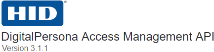

###### [DigitalPersona Access Management API ](https://lenhodgeman.github.io/digitalpersona-access-management-api/)/ Web Access Services  

  

## Access Management Services  

The DigitalPersona Access management Services are a collection of RESTful services used to implement various features of the DigitalPersona solution in web-applications.

These services are:

- Web Enrollment Services (WES)
- Web Secret Management Service (WSMS)  
- Web Authentication Service (WAS)
- Web Authentication Policy Service (WAPS)

The last three of the services mentioned above were formerly part of the DigitalPersona Web AUTH SDK.

To view the digitalpersona-access-management-services GitHub Pages *documentation*, click the following link.

[Digitalpersona Access Management Services documentation](https://lenhodgeman.github.io/digitalpersona-access-management-services/)

To view the digitalpersona-services *repository*, click this link.

[Digitalpersona Access Management Services  repository](https://github.com/LenHodgeman/digitalpersona-access-management-services/)
