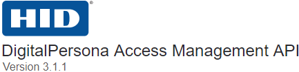

---
layout: default
title: Devices API
has_toc: false
nav_order: 6
---  
[DP Access Management API /](https://lenhodgeman.github.io/DP-Access-Management-API/)  

  

### Devices API  

The DigitalPersona Devices API provides access to devices supported by the DigitalPersona Access Management API.

[Could use additional content, but not duplicating or overlapping the main content on the authentication repo.]

To view the digitalpersona-core repo, click the following link.

[Digitalpersona Authentication API Repo](https://lenhodgeman.github.io/digitalpersona-devices/)
